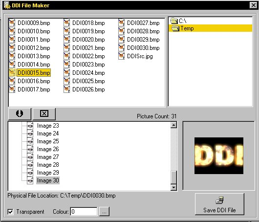



## Direct Draw Interface \(Complete Game Engine and Example\)

### Description

Direct Draw Interface (DDI) is a DLL that brings the speed and power of DirectX to a simple program! Note: after making full games with less than 50 lines of code, you might get a bit rusty at real programing, but until then: heres what you get (FOR FREE):

The DDI engine and Source.

The DDI Filemaker.

A Test Program.

Commented fully and ready for your enjoyment!

(it's a good idea to have Dx7VB.dll)
 
### More Info
 

             |
---                |---
**Submitted On**   |2000-12-07 09:09:54
**By**             |[Michael Pot&\#232;](https://github.com/Planet-Source-Code/PSCIndex/blob/master/ByAuthor/michael-pot-232.md)
**Level**          |Advanced
**User Rating**    |5.0 (25 globes from 5 users)
**Compatibility**  |VB 4\.0 \(32\-bit\), VB 5\.0, VB 6\.0
**Category**       |[Games](https://github.com/Planet-Source-Code/PSCIndex/blob/master/ByCategory/games__1-38.md)
**World**          |[Visual Basic](https://github.com/Planet-Source-Code/PSCIndex/blob/master/ByWorld/visual-basic.md)
**Archive File**   |[CODE\_UPLOAD124181272000\.zip](https://github.com/Planet-Source-Code/michael-pot-232-direct-draw-interface-complete-game-engine-and-example__1-13395/archive/master.zip)

